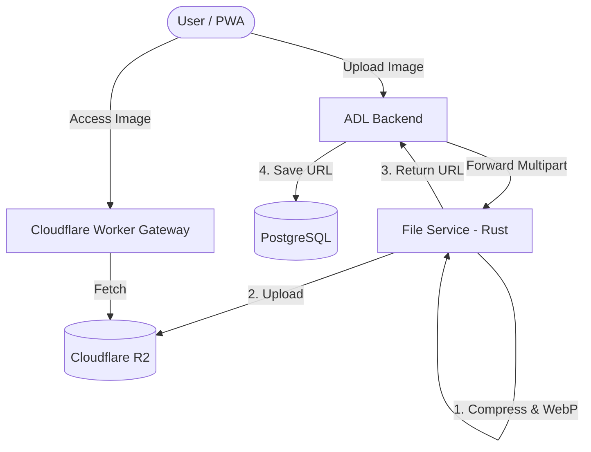

# ADL File Service 🦀

A high-performance Rust microservice designed for the **ADL (Activity Daily Living)** ecosystem. This service handles image uploads, compression, and optimization, storing the final assets in **Cloudflare R2 Object Storage**. It features a Cloudflare Worker gateway to serve assets efficiently without requiring a custom domain.

## 🏗 System Architecture

The file service follows a decoupled microservice architecture:



### Key Components:
1.  **File Service (Rust)**: Performs compute-heavy tasks like image resizing and WebP encoding.
2.  **Cloudflare R2**: S3-compatible object storage for persistent asset hosting.
3.  **Cloudflare Worker Gateway**: Acts as a lightweight proxy to serve R2 assets publicly, bypassing ISP blocks often associated with default `.r2.dev` subdomains.

---

## 🚀 Features
- **Auto-Compression**: Automatically converts JPEG/PNG to **WebP** with 75% quality.
- **Smart Resizing**: 
  - `Avatar`: Max 512px.
  - `Activity`: Max 1080px.
- **Layered Architecture**: Clean separation between Handlers, Services, and Infrastructure.
- **S3 Compatibility**: Integrated with Cloudflare R2 using the AWS SDK for Rust.

---

## 🛠 Prerequisites
- [Rust & Cargo](https://rustup.rs/) (latest stable).
- A Cloudflare account with an R2 Bucket created.

---

## ⚙️ Configuration (Setup)
1. Copy `.env.example` to `.env`:
   ```bash
   cp .env.example .env
   ```
2. Configure your Cloudflare R2 credentials in `.env`:
   - `R2_ACCOUNT_ID`: Your Cloudflare Account ID.
   - `R2_ACCESS_KEY_ID`: R2 Access Key.
   - `R2_SECRET_ACCESS_KEY`: R2 Secret Key.
   - `R2_BUCKET_NAME`: Your bucket name.
   - `R2_PUBLIC_URL`: Your Cloudflare Worker URL (e.g., `https://adl-images.arifinoid.workers.dev`).

---

## 🏃 How to Run
To start the service in development mode:
```bash
cargo run
```
The service will be available at: `http://localhost:8080`

---

## 🧪 Testing
Run the image compression unit tests:
```bash
cargo test
```

---

## 📖 API Documentation

All endpoints expect `multipart/form-data` with the image file in a field named `file`.

### 1. Upload Avatar
Optimizes and uploads user profile pictures.
- **URL**: `/api/upload/avatar`
- **Method**: `POST`
- **Response (200 OK)**:
  ```json
  {
    "url": "https://your-worker.workers.dev/uuid.webp"
  }
  ```

### 2. Upload Activity
Optimizes and uploads activity-related images.
- **URL**: `/api/upload/activity`
- **Method**: `POST`
- **Response (200 OK)**:
  ```json
  {
    "url": "https://your-worker.workers.dev/uuid.webp"
  }
  ```

---

## 🌐 Public Asset Gateway (Cloudflare Worker)

To serve R2 assets publicly without a custom domain, use the following Cloudflare Worker script. This ensures better accessibility and avoids common ISP restrictions.

### Worker Script (`src/index.js`):
```javascript
export default {
  async fetch(request, env) {
    try {
      const url = new URL(request.url);
      const key = url.pathname.slice(1);

      if (!env.MY_BUCKET) return new Response("Bucket Binding Missing", { status: 500 });

      const object = await env.MY_BUCKET.get(key);
      if (object === null) return new Response("Not Found", { status: 404 });

      const headers = new Headers();
      object.writeHttpMetadata(headers);
      headers.set("etag", object.httpEtag);
      headers.set("Cache-Control", "public, max-age=31536000");

      return new Response(object.body, { headers });
    } catch (e) {
      return new Response(e.message, { status: 500 });
    }
  }
};
```

### Wrangler Configuration (`wrangler.jsonc`):
Ensure the R2 bucket is correctly bound to the worker:
```json
"r2_buckets": [
  {
    "binding": "MY_BUCKET",
    "bucket_name": "your-bucket-name"
  }
]
```
